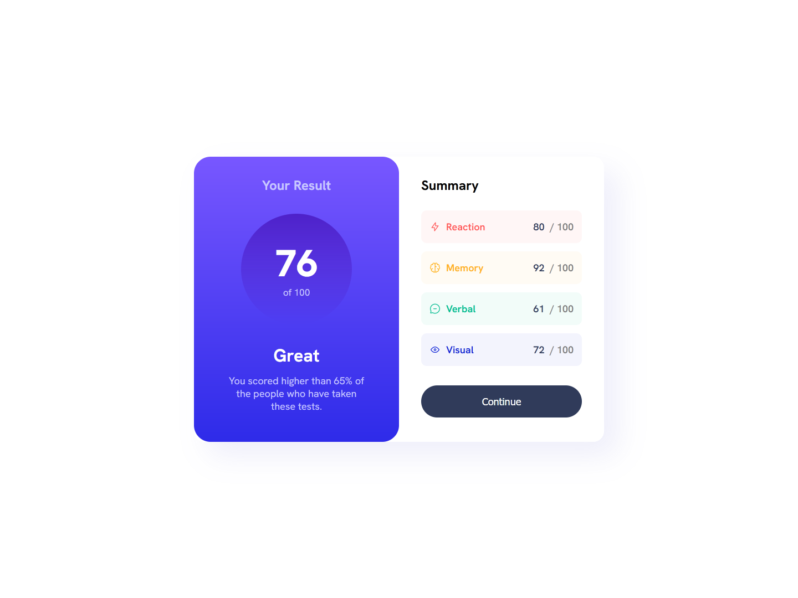

# Frontend Mentor - Results summary component solution

This is a solution to the [Results summary component challenge on Frontend Mentor](https://www.frontendmentor.io/challenges/results-summary-component-CE_K6s0maV). Frontend Mentor challenges help you improve your coding skills by building realistic projects. 

## Table of contents

- [Overview](#overview)
  - [The challenge](#the-challenge)
  - [Screenshot](#screenshot)
  - [Links](#links)
- [My process](#my-process)
  - [Built with](#built-with)
  - [What I learned](#what-i-learned)
  - [Continued development](#continued-development)
  - [Useful resources](#useful-resources)
- [Author](#author)

## Overview

### The challenge

Users should be able to:

- View the optimal layout for the interface depending on their device's screen size
- See hover and focus states for all interactive elements on the page
- **Bonus**: Use the local JSON data to dynamically populate the content

### Screenshot

### Links

- Solution URL: [Github](https://github.com/Absynthee/results-summary-components-main)
- Live Site URL: [Github Pages](https://absynthee.github.io/results-summary-components-main/)

## My process

### Built with

- Semantic HTML5 markup
- CSS custom properties
- Flexbox
- Javascript

### What I learned

There was a lot of styling in this project and it took me a while to name and position everything correctly. 

I learned more about flexbox and more about javascript. It was also my first time using json, and while the json format is pretty straightforward, I didn't know how to actually put that data on the page.

**Update** 17/05/2024

I returned to this project after a couple of months to clean up the code and correctly populate the data using the information in the json file. 

### Continued development

Continued development for this project would be to make more use of json/javascript for generating and storing data.

### Useful resources

- [Stack Overflow](https://stackoverflow.com/questions/12070631/how-to-use-json-file-in-html-code) - JSON & JS learning.

## Author

- Website - [Austin Spillman](https://www.austinspillman.com)
- Frontend Mentor - [@Absynthee](https://www.frontendmentor.io/profile/Absynthee)

